# ClassTrack — Student Academic Management System

> A full-stack **MERN** platform for lecture-wise attendance, mid-exam marks, timetables, analytics, and role-based academic workflows.


---

## Table of Contents

- [Overview](#overview)
- [Key Features](#key-features)
- [Tech Stack](#tech-stack)
- [Architecture](#architecture)
- [Screenshots](#screenshots)
  - [Login](#login)
  - [Admin Portal](#admin-portal)
  - [Faculty Portal](#faculty-portal)
  - [Student Portal](#student-portal)
- [Demo Credentials](#demo-credentials)
- [Getting Started](#getting-started)
- [Environment Variables](#environment-variables)
- [API Overview](#api-overview)
- [Project Structure](#project-structure)
- [Documentation & Reports](#documentation--reports)
- [Team](#team)
- [Future Roadmap](#future-roadmap)

---

## Overview

**ClassTrack** digitizes the daily academic loop of a college:

| Role | What they do |
|------|----------------|
| **Admin** | Manage students, faculty, subjects, timetable slots; broadcast notifications |
| **Faculty** | See today’s lectures, take attendance in seconds, analyze performance, enter marks, export reports |
| **Student** | View timetable, subject-wise attendance %, low-attendance warnings, and marks |

Business rules (attendance %, 75% threshold, analytics) are computed **on the server** from raw records — the client never invents percentages.

**Scale of codebase**

| Part | Files | ~Lines |
|------|------:|-------:|
| Backend | 34 | 2,271 |
| Frontend `src/` | 32 | 4,902 |
| **Total source** | **66** | **~7,173** |

---

## Key Features

### Authentication & Security
- JWT login (7-day expiry) + bcrypt password hashing (10 rounds)
- Role-based access control (Admin / Faculty / Student)
- Ownership checks (students always resolved from JWT — anti-IDOR)
- Faculty restricted to **assigned subjects** and **own lecture slots**
- Duplicate attendance/marks blocked by MongoDB unique indexes
- CORS locked to the frontend origin; secrets in `.env`

### Attendance
- Lecture-oriented submission with present/absent bulk controls
- Upsert on re-submit (no duplicate rows)
- Future-date rejection
- Subject-wise & overall % (server aggregation)
- Analytics: category pie/bar charts, daily trend line, stats cards, filter pills
- Daily register (P / A / U per lecture) + threshold class report
- Print-to-PDF export via print CSS

### Marks
- Faculty enter marks for a whole class (range-validated)
- Upsert per `(student, subject, examType, academicYear)`
- Auto-notification to student when marks are uploaded
- Students view only **their own** marks (read-only, pass/fail colors)

### Timetable & Notifications
- Admin CRUD for lecture slots (day, time, room, division…)
- Role-aware “today” view (server resolves weekday + profile)
- In-app notification bell (unread badge, 45s poll, mark all read)
- Auto low-attendance warnings (< 75%)

### Frontend UX
- CRM-style design system (cards, tables, modals, badges, print styles)
- Global **react-hot-toast** feedback for validation, success, and API errors
- Protected routes per role; session restore; auto logout on 401
- Responsive sidebar layout; Recharts analytics dashboard

---

## Tech Stack

### Frontend
| Technology | Purpose |
|------------|---------|
| React 19 + Vite 8 | UI + dev server / production build |
| React Router 7 | Client routes + protected guards |
| Axios | HTTP client + JWT interceptors |
| Recharts | Attendance charts |
| react-hot-toast | Global toast notifications |
| CSS3 | Custom design system + print stylesheet |

### Backend
| Technology | Purpose |
|------------|---------|
| Node.js + Express 5 | REST API (41 endpoints) |
| MongoDB + Mongoose | Data store, indexes, aggregation |
| jsonwebtoken | Stateless auth |
| bcryptjs | Password hashing |
| cors / dotenv | CORS + config |

---

## Architecture

```
Browser (Admin / Faculty / Student)
        │
        ▼
React SPA (:5173)
  Pages · Layout · AuthContext · Axios services
        │  HTTP + Authorization: Bearer <JWT>
        ▼
Express API (:5000)
  Routes → auth/authorize middleware → Controllers → Services → Models
        │
        ▼
MongoDB (:27017)  ·  classtrack_v2
```

---

## Screenshots

> All images live in the [`PROJECT/`](./PROJECT) folder.

### Login

Premium split-screen login with one-click demo credentials:

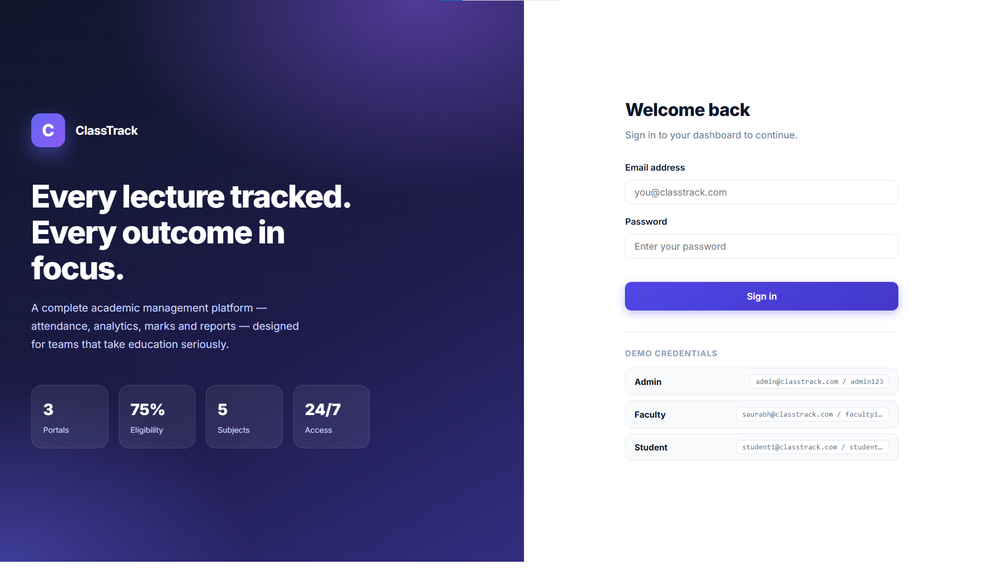

---

### Admin Portal

**Dashboard** — entity counts and quick links:

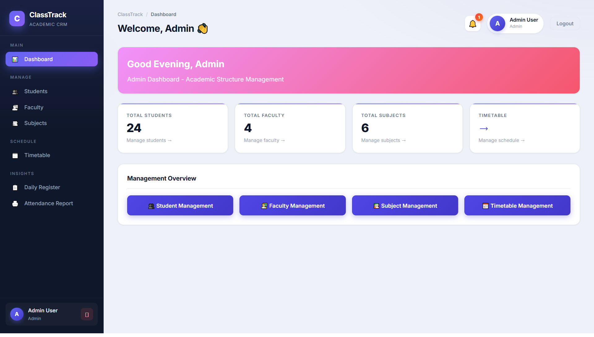

**Student Management** — search, create, edit, delete:

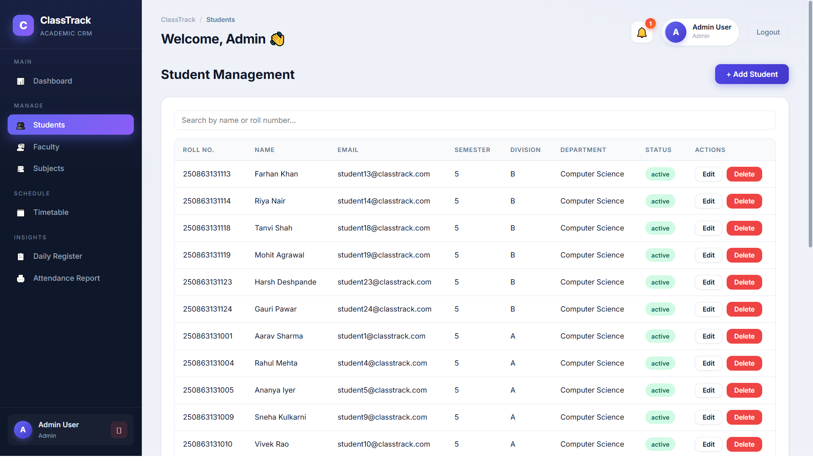

**Faculty Management** — profile + subject multi-assign:

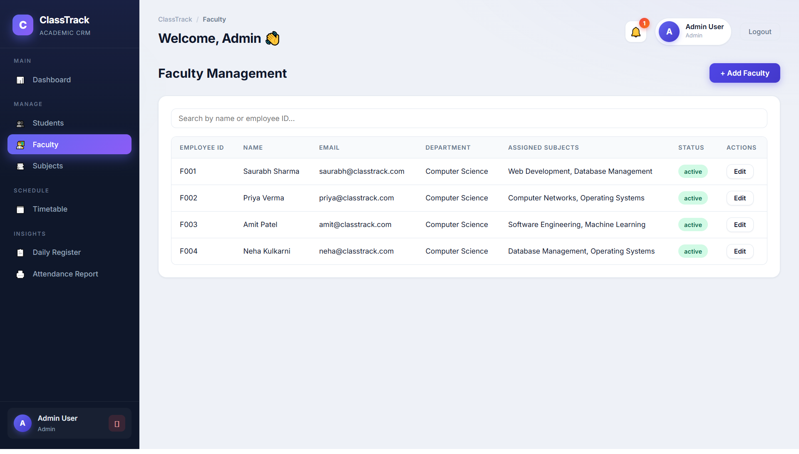

**Subject Management** — codes, semester, teaching faculty:

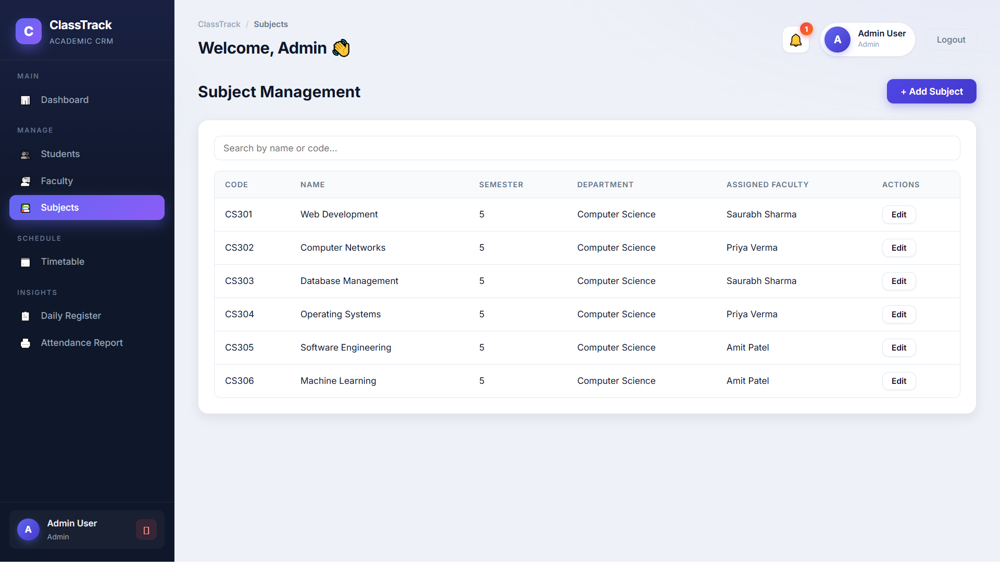

**Timetable Management** — day/semester filters + CRUD:

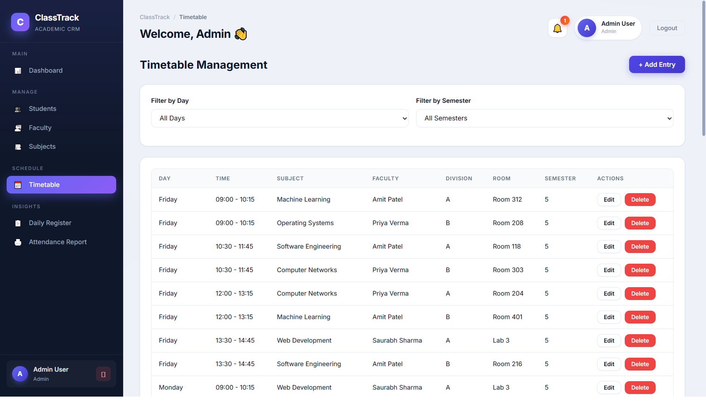

**Broadcast Notifications** — message students / faculty / all:

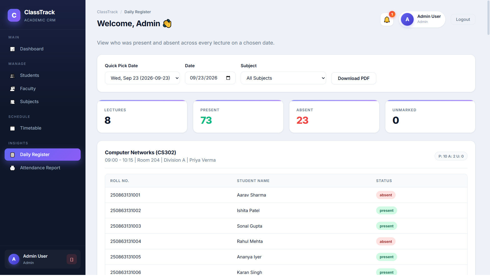

**Admin — Additional Screen:**

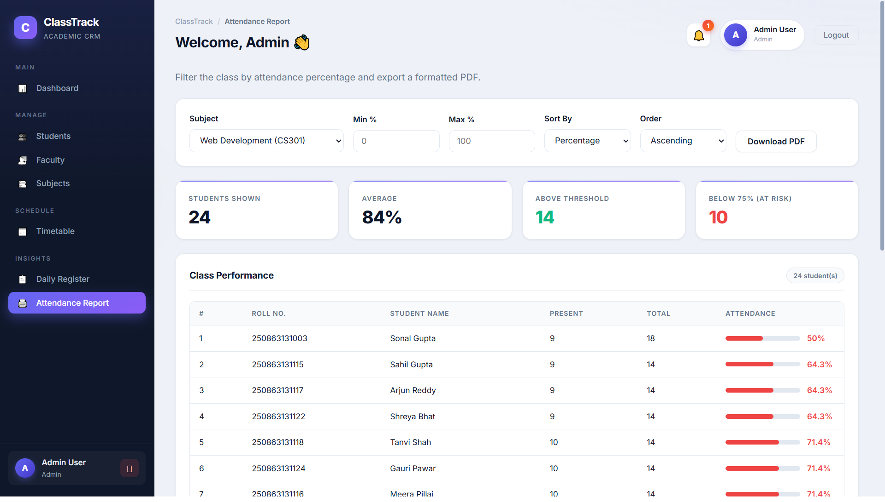

---

### Faculty Portal

**Faculty Dashboard** — assigned subjects, today’s lectures, attendance-taken badges:

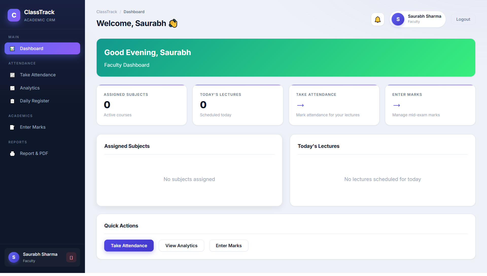

**Attendance Entry** — roster, mark-all controls, live counters, submit:

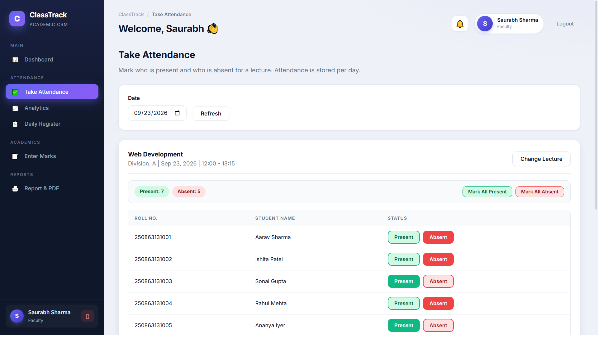

**Attendance Analytics** — pie, bars, daily trend, stats, filters:

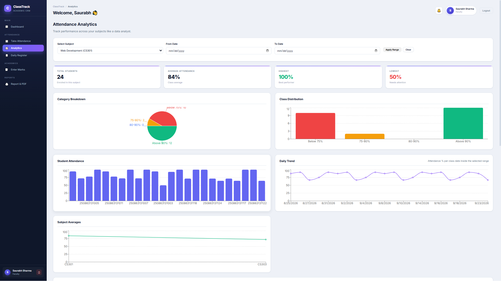

**Marks Entry** — subject / exam type / max marks + class table:

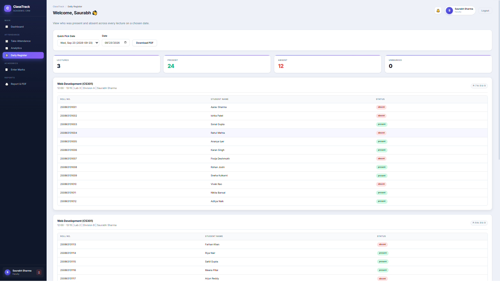

**Daily Register** — present / absent / unmarked per lecture:

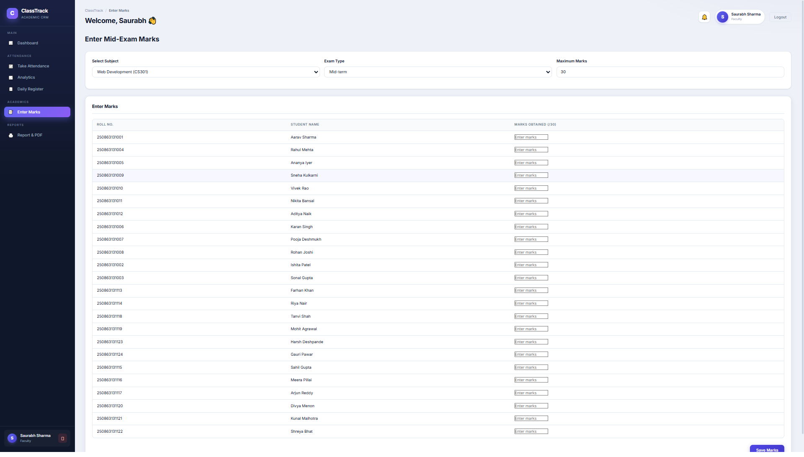

**Class Report** — threshold filters + print/PDF export:

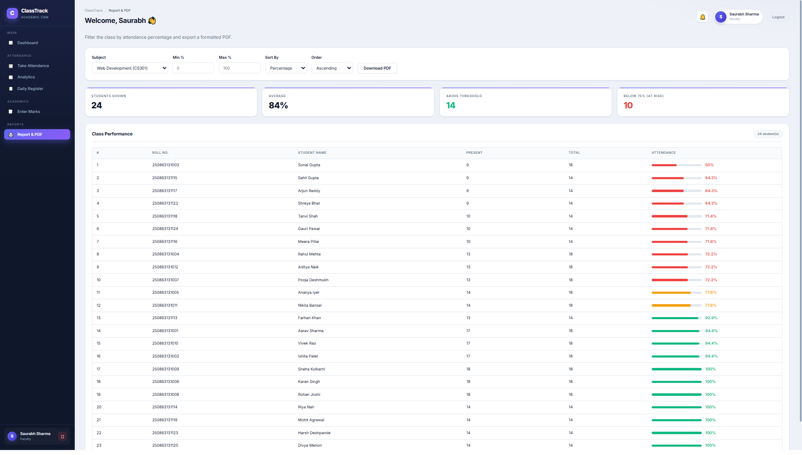

**Faculty — Additional Screen:**

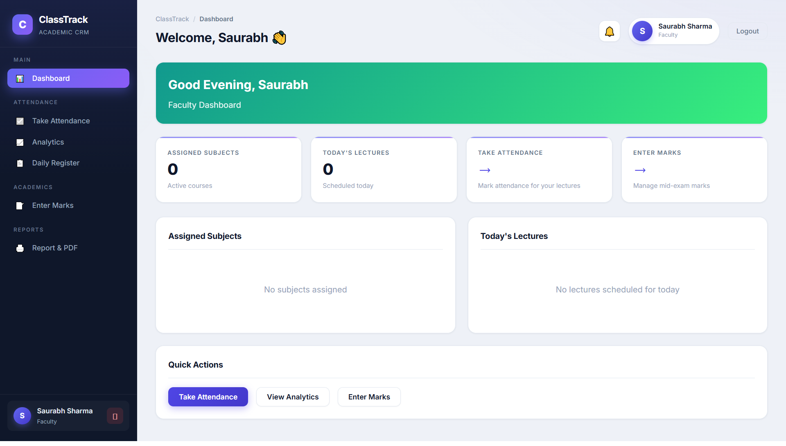

---

### Student Portal

**Student Dashboard** — attendance %, warnings, today’s timetable, marks summary:

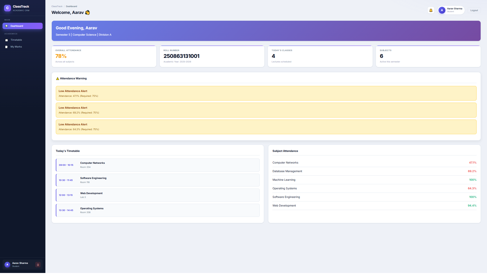

**Student View** — weekly timetable / marks with pass-fail coding:

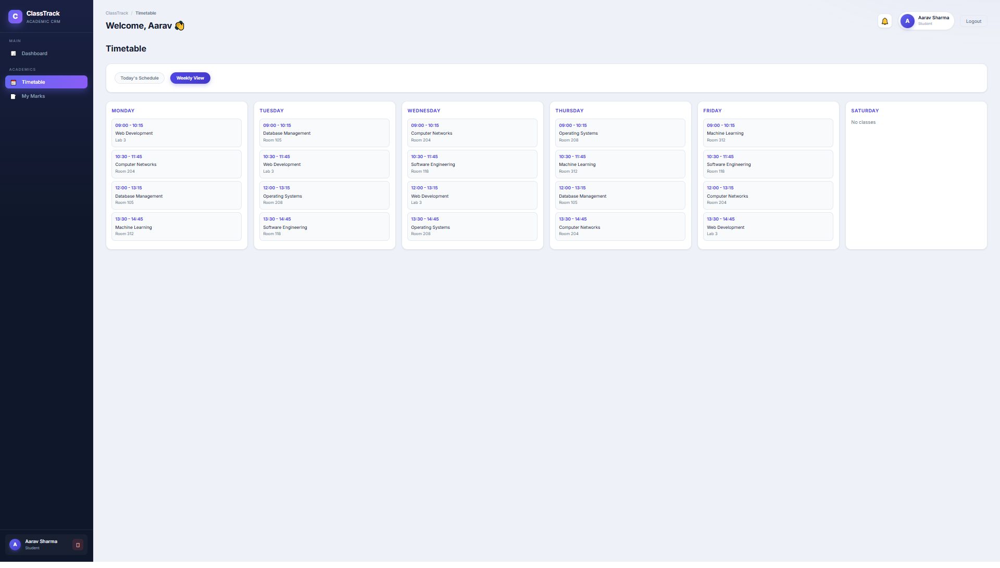

---

## Demo Credentials

Run `npm run seed` in `backend/` first (loads realistic demo data).

| Role | Email | Password |
|------|-------|----------|
| **Admin** | `admin@classtrack.com` | `admin123` |
| **Faculty** | `saurabh@classtrack.com` | `faculty123` |
| **Faculty** | `priya@classtrack.com` | `faculty123` |
| **Faculty** | `amit@classtrack.com` | `faculty123` |
| **Faculty** | `neha@classtrack.com` | `faculty123` |
| **Student** | `student1@classtrack.com` … `student24@classtrack.com` | `student123` |

---

## Getting Started

### Prerequisites

- **Node.js** 18+
- **MongoDB** running locally on port `27017` (or Atlas URI)

### 1. Clone

```bash
git clone https://github.com/Code-with-saurabh/ClassTrack.git
cd ClassTrack
```

### 2. Backend

```bash
cd backend
npm install
```

Create `backend/.env`:

```env
PORT=5000
MONGO_URI=mongodb://localhost:27017/classtrack_v2
JWT_SECRET=change-me-to-a-long-secret
JWT_EXPIRE=7d
CLIENT_URL=http://localhost:5173
NODE_ENV=development
```

```bash
npm run seed    # reset + load demo dataset
npm run dev     # API → http://localhost:5000
```

### 3. Frontend (new terminal)

```bash
cd frontend
npm install
npm run dev     # UI → http://localhost:5173
```

Open **http://localhost:5173** and sign in with a demo account.

### Verify backend health

```bash
curl http://localhost:5000/api/health
# {"success":true,"message":"ClassTrack API is running"}
```

### Quality commands

```bash
cd frontend
npm run lint    # oxlint
npm run build   # production build
```

---

## Environment Variables

| Variable | Where | Example |
|----------|-------|---------|
| `PORT` | backend | `5000` |
| `MONGO_URI` | backend | `mongodb://localhost:27017/classtrack_v2` |
| `JWT_SECRET` | backend | long random string (**never commit**) |
| `JWT_EXPIRE` | backend | `7d` |
| `CLIENT_URL` | backend | `http://localhost:5173` |
| `VITE_API_URL` | frontend (optional) | `http://localhost:5000/api` |

---

## API Overview

Base URL: `http://localhost:5000/api`  
Protected routes: `Authorization: Bearer <token>`

| Module | Endpoints | Examples |
|--------|----------:|----------|
| Auth + Health | 4 | `POST /auth/login`, `GET /auth/me` |
| Students | 6 | `GET/POST/PUT/DELETE /students` |
| Faculty | 5 | `GET /faculty/subjects`, `POST /faculty` |
| Subjects | 4 | `GET/POST/PUT /subjects` |
| Timetable | 5 | `GET /timetable/today`, CRUD |
| Attendance | 8 | `POST /attendance`, `GET /attendance/analytics` |
| Marks | 4 | `POST /marks`, `GET /marks/student/:id` |
| Notifications | 5 | `GET /notifications/unread-count` |
| **Total** | **41** | |

Full API details: see **API Overview** above and the WAD reports in `docs/` (local).

---

## Project Structure

```
ClassTrack/
├── backend/
│   ├── config/db.js
│   ├── models/          # 8 schemas (User, Student, Faculty, …)
│   ├── controllers/     # 8 controllers
│   ├── routes/          # 8 route files
│   ├── middleware/      # auth, authorize, errorHandler
│   ├── services/        # attendance analytics engine
│   ├── utils/           # date, mongoid helpers
│   ├── app.js  server.js  seed.js
│   └── .env             # secrets (git-ignored)
│
├── frontend/
│   ├── src/
│   │   ├── pages/       # 15 screens (Login, dashboards, CRUD…)
│   │   ├── components/  # Layout, Pagination
│   │   ├── context/     # AuthContext
│   │   ├── services/    # api + 8 module clients
│   │   ├── utils/       # helpers, toastHelpers
│   │   └── App.jsx  App.css  main.jsx
│   └── index.html  vite.config.js
│
├── docs/                # PRD, reports, architecture notes
├── PROJECT/             # UI screenshots (README gallery)
├── README.md
└── .gitignore
```

---

## Documentation & Reports

> Reports live under [`docs/`](./docs) (kept out of the public repo via `.gitignore` for submission). Paths below are for local checkout:

| Document | Description |
|----------|-------------|
| `docs/PROJECT_REPORT.md` | Full backend project report (WAD) + PDF |
| `docs/PROJECT_REPORT_FRONTEND_SONAL.md` | Frontend Part 1 — foundation & student module |
| `docs/PROJECT_REPORT_FRONTEND_PRISA.md` | Frontend Part 2 — faculty & admin modules |
| `docs/PROJECT.md` | Complete technical documentation |
| `docs/prd.md` | Product requirements |
| `docs/memory.md` | Decision log / change history |

---

## Team

| Name | Enrollment | Contribution |
|------|------------|--------------|
| **Saurabh Sharma** | 250863131007 | Backend — APIs, models, auth, analytics, seed system |
| **Sonal** | 250863131003 | Frontend Part 1 — app shell, auth, design system, student UI |
| **Prisa** | 250863131006 | Frontend Part 2 — faculty attendance/analytics + admin CRUD |

---

## Future Roadmap

- Automated tests (Jest/Vitest + RTL) and CI
- Cloud deployment (Vercel + Render + MongoDB Atlas)
- CSV export/import for reports and marks
- Email/SMS alerts for low attendance
- QR-code attendance and realtime sockets
- Attendance projection widget (“classes needed for 75%”)
- Visual timetable builder with clash detection

---

<div align="center">

**ClassTrack** · Built for the **Web Application Development (WAD)** lab

Repository: [github.com/Code-with-saurabh/ClassTrack](https://github.com/Code-with-saurabh/ClassTrack)

</div>
